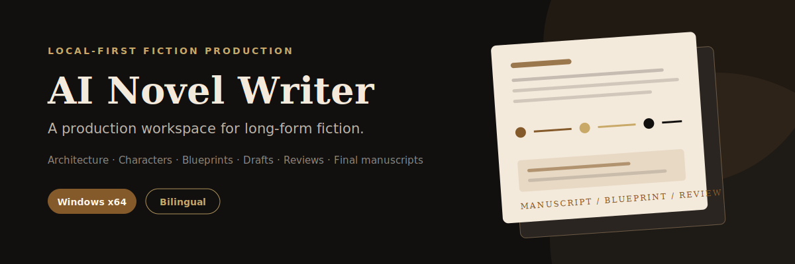

<p align="center">
  
</p>

<p align="center">
  <a href="README_zh.md">简体中文</a> ·
  <a href="https://github.com/EthanYoQ/AI-Novel-Writer/releases/latest">Download for Windows</a> ·
  <a href="LICENSE">GPL-3.0</a>
</p>

AI Novel Writer is a local-first desktop workspace that turns a story idea into a managed long-form production pipeline: architecture, characters, chapter blueprints, drafts, reviews, revisions, and final manuscripts.

It is an orchestration layer, not a bundled AI model. Connect an OpenAI-compatible endpoint or Gemini provider; local endpoints such as Ollama and LM Studio are supported alongside external APIs.


## Why this exists

Chat is good at producing a scene. A novel needs memory, constraints, checkpoints, and durable artifacts. AI Novel Writer keeps those pieces in one project workspace:

- Story premise, character dynamics, world building, and synopsis
- Editable per-chapter blueprints with goals, events, cast, and hooks
- Draft → review → revision → finalization workflow
- Character cards, relationship graph, and chapter-by-chapter state
- SQLite full-text retrieval with optional LanceDB vector search
- TXT/Markdown reference import, structure inference, and style analysis
- Project-level and global prompt overrides
- Simplified Chinese and English application interface

## v0.2.0

This release focuses on reliability and accessibility:

- Adds a Chinese/English switch for the application interface, system notices, and error messages. The first launch follows the operating-system language; a manual choice is persisted.
- Keeps creative prompt templates, generated prose, and project data unchanged when switching languages.
- Packages the Windows LanceDB native binding explicitly and verifies that the packaged app can load it.
- Loads the knowledge-base subsystem only when it is used, so an optional native failure can no longer prevent the whole application from opening.
- Cleans release output before packaging and verifies the packaged executable, `app.asar`, native module, process stability, and visible window creation.

## Windows installation

1. Download `AI-Novel-Writer-0.2.0-windows-x64.zip` from [GitHub Releases](https://github.com/EthanYoQ/AI-Novel-Writer/releases/latest).
2. Extract the archive completely.
3. Open the extracted `AI-Novel-Writer` folder.
4. Launch `AI小说作家.exe`.

Do not run the executable from inside the ZIP. Windows x64 is the currently published desktop target.

## Production pipeline

```text
Story idea / project configuration
                │
                ▼
Premise → Characters → World building → Synopsis
                │
                ▼
        Chapter blueprints
                │
                ▼
Draft → Review → Revision → Final manuscript
                │
                ▼
Knowledge retrieval + character-state updates
```

The workspace keeps global constraints and chapter-level intent separate. A draft can be reviewed before revision, and a revision can be compared before it replaces the working draft.

## Model setup

For a local OpenAI-compatible endpoint:

```text
Provider: Ollama or Custom
Protocol: OpenAI-compatible
Base URL: http://127.0.0.1:11434/v1
API key: ollama
Model: your-local-model-name
```

The application does not ship a model. When you configure an external provider, prompts and selected project context are sent to that provider according to its own privacy terms.

## Development

Requirements: Node.js 20+, pnpm 11, and Windows for desktop packaging.

```bash
pnpm install --frozen-lockfile
pnpm dev
```

Quality checks:

```bash
pnpm run typecheck
pnpm test
pnpm run lint
```

Build and verify an unpacked Windows app:

```powershell
pnpm run build:win-dir
pnpm run smoke:win-app
```

Create the release ZIP and checksum:

```powershell
powershell -ExecutionPolicy Bypass -File scripts/package-win-zip.ps1
```

Expected asset: `release/0.2.0/AI-Novel-Writer-0.2.0-windows-x64.zip`.

## Data and security

Project files and the application database stay on the local machine by default. Never commit project manuscripts, imported reference novels, API keys, `.env` files, user configuration, or generated release directories.

The application can connect to local or remote model endpoints. “Local-first” describes storage and orchestration; it does not make a remote provider local.

## License

Distributed under the [GNU General Public License v3.0](LICENSE).
