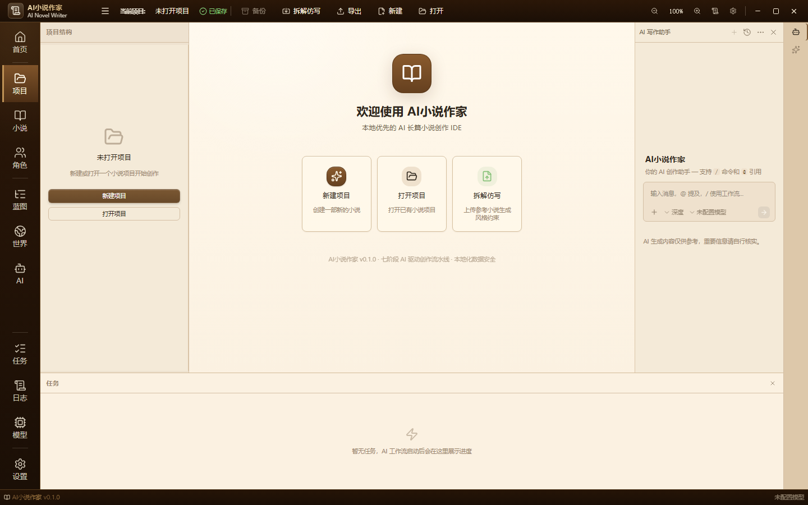
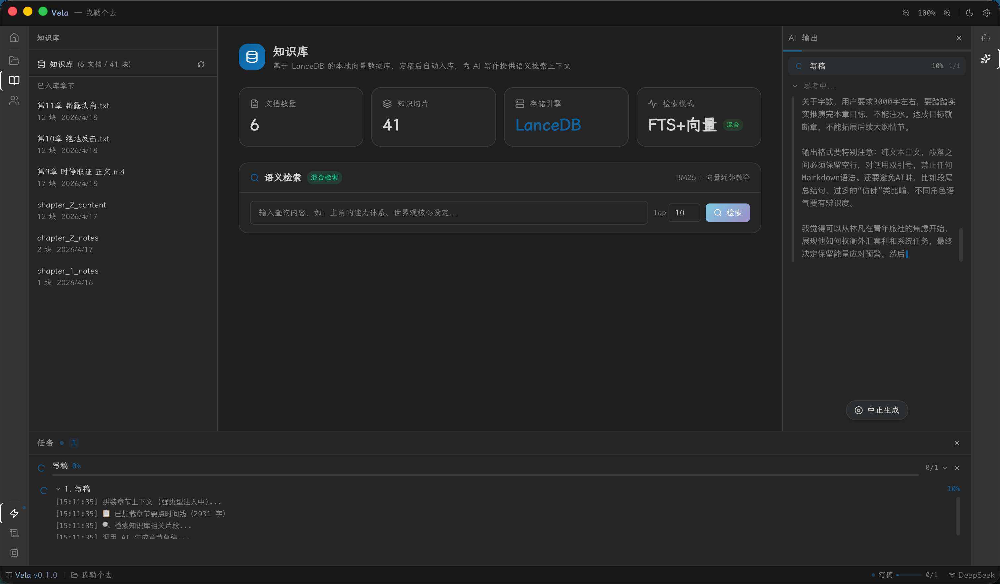
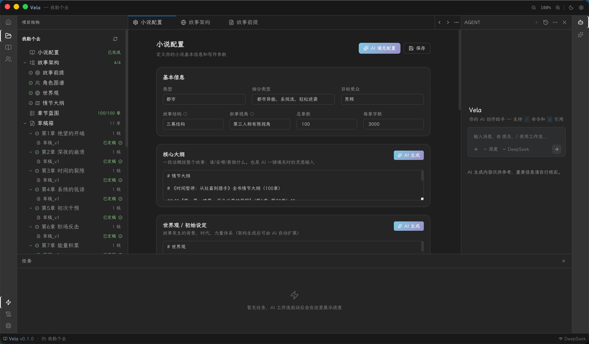
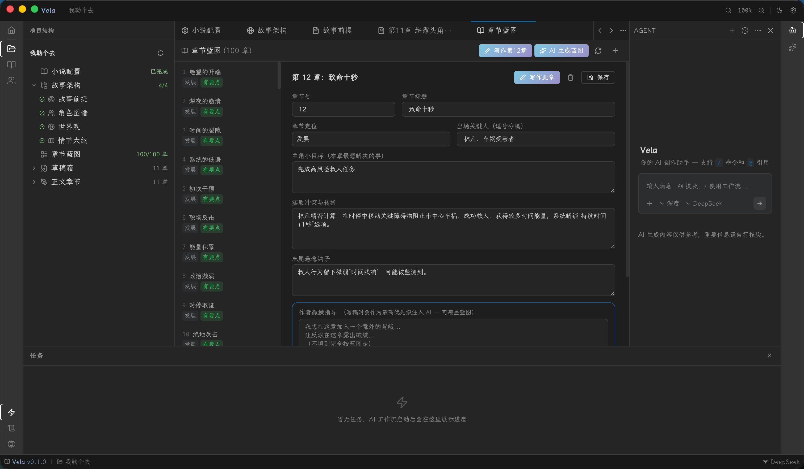
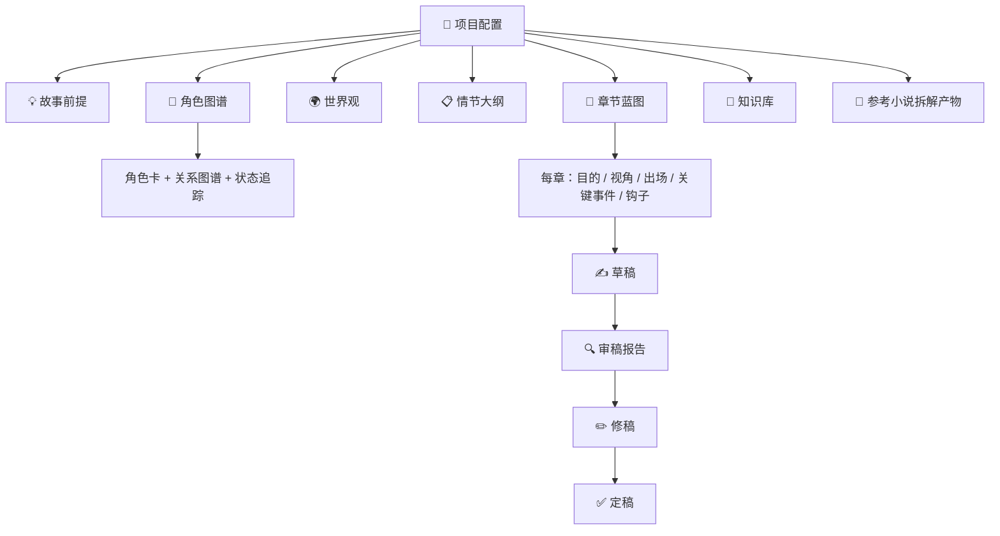

<div align="center">

[English](README_en.md) | **中文**

</div>

<p align="center">
  
</p>

<h1 align="center">AI 小说作家 / AI Novel Writer</h1>

<p align="center">
  面向中文创作者的本地优先 AI 长篇小说写作工具：把"前提 → 角色 → 世界观 → 章节蓝图 → 草稿 → 审稿 → 修稿 → 定稿"做成一条带记忆的生产线，让 AI 每次只写本章、每次都看蓝图、每章都过审稿。
</p>

<p align="center">
  搜索意图：<strong>AI 小说写作</strong>、<strong>AI 小说作家</strong>、<strong>本地模型写作</strong>、<strong>Ollama 写小说</strong>、<strong>长篇小说 AI</strong>、<strong>NSFW 写作</strong>、<strong>AI 写小说工具</strong>、<strong>本地部署写作</strong>。
</p>

<p align="center">
  <a href="https://github.com/EthanYoQ/AI-Novel-Writer/releases"></a>
  <a href="https://github.com/EthanYoQ/AI-Novel-Writer/blob/master/LICENSE"></a>
  <a href="https://github.com/EthanYoQ/AI-Novel-Writer/stargazers"></a>
</p>

<p align="center">
  <a href="https://github.com/EthanYoQ/AI-Novel-Writer/releases/latest">下载最新版 Windows 安装包</a>
</p>

<p align="center">
  
</p>

---

## 🎯 一句话说明

AI 小说作家不是聊天机器人，也不是简单的 AI 写作助手。

它只做一件事：**把长篇小说的创作过程从"和 AI 来回扯皮"变成一条带记忆、带结构、带审稿的流水线。你出主意，AI 出体力；你改设定，结构自动同步；你写完一章，审稿报告自动指出哪里崩了。**

适合这些场景：

| 场景 | 传统做法 | AI 小说作家帮你做 |
| --- | --- | --- |
| 📚 从零写长篇 | 和 ChatGPT 对话几百轮，主角性格、时间线、伏笔全部崩掉 | 角色卡 + 大纲 + 章节蓝图互相锁定，AI 每章只写本章，不改设定 |
| 🔓 写受限制内容 | 云端 API 说"主角受伤"也拒绝，无法写成人、恐怖或政治敏感题材 | 本地模型（abliterated / uncensored）直连，包括 **NSFW / 成人方向** 在内的任何虚构题材都能写 |
| 🎨 仿写喜欢的小说 | 反复教 AI"要有那种味道"，但永远不知道具体是哪种语气 | 导入任意格式小说（TXT / Markdown / EPUB / HTML 等），自动拆解文风、节奏、角色配方，AI 照单全收 |
| 🧩 改设定后全书同步 | 手动翻前面几十章找受影响的地方 | 改角色卡 → 所有引用它的章节蓝图自动标红；改世界观 → 所有章节自动检查一致性 |
| 🔧 修稿 | 自己逐字对照，找时间线矛盾和角色漂移 | 每章自动生成审稿报告，列出角色状态、时间线、设定冲突，用报告驱动修稿 |

---

## 🧭 它怎么工作


每次生成草稿前，AI 都会拿到：本章蓝图 + 相关角色卡 + 世界观片段 + 文风约束 + 历史摘要。它**不会忘记第 5 章埋的伏笔**。

---

## 🖥️ 界面预览

### 主界面：项目结构 + 欢迎页 + AI 写作助手


### 角色管理：角色卡与关系图谱



### 章节蓝图：每章的目的、视角、出场、关键事件



### 草稿与修稿：AI 生成 + 审稿驱动



---

## ✨ 核心能力

| 图标 | 能力 | 解决的问题 |
| --- | --- | --- |
| 🔓 | 本地模型 + 无审查写作 | 本地模型（Ollama / LM Studio / vLLM）直连，突破云端内容安全策略，支持 **NSFW / 成人方向** 等虚构创作 |
| 🎨 | 参考小说拆解仿写 | 导入任意格式小说（TXT / Markdown / EPUB / HTML 等），自动分章、反推设定、提取角色、生成文风约束，不限格式 |
| 🧩 | 角色/大纲/蓝图互锁 | 角色卡、世界观、章节蓝图互相引用，改设定后所有关联章节自动标记，靠结构解决一致性 |
| 📑 | 按章蓝图生成草稿 | AI 只写本章，每次读取本章蓝图 + 相关角色卡 + 历史摘要，避免越界发挥 |
| 🔍 | 自动审稿报告 | 每章草稿完成后，AI 自动生成结构化审稿报告（角色状态、时间线、设定冲突、逻辑漏洞），再用报告驱动修稿 |
| 📖 | 知识库检索 | 导入 TXT / Markdown / EPUB 等格式文档，配置 embedding 后走向量检索，没配置走 SQLite FTS 全文检索 |
| 🧭 | 故事架构生成 | 按步骤生成前提、角色图谱、世界观、情节大纲，从零到一搭建长篇小说骨架 |
| 🔌 | 模型自由 | 支持任何 OpenAI 兼容端点（本地 / 云端），包括已解锁 / uncensored 权重 |
| 🌐 | 中英界面 | 首次启动跟随系统语言，手动切换后持久化 |

---

## 🔓 本地模型 + 无审查创作（含 NSFW / 成人方向）

云端 API 的内容安全策略不会因为你在写虚构小说就放行——**你写的主角在小说里受伤、写成人亲密场景，模型可能拒答**。本地模型没有这个问题：

| 接入方式 | 适合场景 |
| --- | --- |
| **Ollama**（推荐） | 一行命令跑 `qwen3:14b-abliterated` 等已解锁权重，支持 **NSFW / 成人 / 暴力 / 恐怖** 等虚构题材 |
| LM Studio / vLLM / KoboldCpp | 本地推理服务，OpenAI 兼容协议直连，模型权重自己选 |
| OpenAI / DeepSeek / Gemini | 不想本机跑模型时的云端备选（仍受云端内容策略限制） |
| 自定义 OpenAI-compatible 端点 | 公司内网代理、其他开源推理服务 |

> 配置文件 `~/.vela/config.json` 里的 `defaultModelId` 指向你的本地模型名即可。项目数据全部落在本机 SQLite 和项目目录里，**不联网也能写**。

---

## 🎨 拆解任意格式小说，仿写它的味道

不限格式。TXT、Markdown、EPUB、HTML……甚至从网页复制的文本，丢进"拆解仿写"：

1. 自动分章（按格式识别章节边界）
2. 反推全局设定（题材、视角、节奏、文风）
3. 提取每个角色的卡（背景、动机、说话习惯）
4. 生成每一章的蓝图（目的、出场、关键事件、悬念钩子）
5. **输出一份文风约束文档**——之后你写自己的小说时，可以把这份约束挂到 AI 的 prompt 里，AI 照着写

这意味着你**不是从零教 AI 怎么写**，而是让 AI 从范本里把"语感"学过去。喜欢某本书的节奏？喜欢某个角色的对话风格？拆解出来，变成可复用的创作配方。

---

## 🧩 结构化记忆：让 AI 记住第 5 章埋的伏笔

长篇小说最大的工程难题不是字数，是**一致性**。AI 小说作家的方案是**把所有创作资产变成可被引用的结构**：



- **改一个角色的设定** → 涉及该角色的所有蓝图自动标红提醒
- **写完一章新稿** → 知识库自动入库，后续章节可检索
- **生成草稿前** → 拼装：本章蓝图 + 相关角色卡 + 世界观片段 + 文风约束 + 历史摘要
- **草稿完成后** → 自动生成结构化**审稿报告**（角色状态、时间线、设定冲突、章内逻辑），再用报告驱动**修稿版本**

AI 永远只看得到它需要看的东西，但**不会忘记关键的设定**。

---

## 🔐 数据与隐私

| 数据 | 默认位置 / 去向 |
| --- | --- |
| 📂 小说项目数据 | 本机项目目录 + SQLite 数据库，完全离线 |
| 📖 导入的参考小说 | 本机项目目录，不上传 |
| ✍️ 生成的草稿 / 修稿 / 定稿 | 本机项目目录，不上传 |
| 🤖 本地模型对话 | 发送到本机 Ollama / LM Studio 等本地服务，不出网 |
| ☁️ 云端 API 对话 | 如果你配置了 OpenAI / DeepSeek / Gemini 等云端 API，提示词和上下文会发送给对应服务商 |
| 🔑 API key / 配置 | 保存在本机 `~/.vela/config.json`，可手动删除 |

你可以在设置中随时切换本地模型和云端模型。**本地优先，数据不出机**。

---

## ⚙️ 推荐配置

| 类型 | 推荐选择 | 说明 |
| --- | --- | --- |
| 🤖 默认模型（本地） | Ollama + qwen3:14b-abliterated | 14B 级别，6GB 显存可跑，中文写作表现优秀，已解锁权重支持无审查创作 |
| 🤖 备用模型（本地） | LM Studio / vLLM | 可选其他模型，适合有更高显存的用户 |
| ☁️ 云端备选 | DeepSeek / OpenAI / Gemini | 不想本地跑模型时的备选，注意受云端内容策略限制 |
| 💾 知识库 Embedding | 默认无需配置 | 不配 embedding 时走 SQLite FTS 全文检索，已覆盖大多数场景 |

---

## 🚀 30 秒跑起来（Ollama 本地模型）

```bash
# 1) 拉一个本地模型（Qwen3 14B 量化版，6GB 显存即可）
ollama pull qwen3:14b

# 2) 在 AI 小说作家的"模型设置"里填：
#    Provider:        custom
#    Protocol:        OpenAI-compatible
#    Base URL:        http://127.0.0.1:11434/v1
#    API key:         ollama
#    Model:           qwen3:14b
#    （或换成社区已解锁的 abliterated 权重，按需自取）

# 3) 新建项目 → 写一句话前提 → 让 AI 依次生成角色 / 世界观 / 蓝图 → 开始写第一章
```

---

## 📦 Windows 安装

发布形式是一个 zip 压缩文件夹：

```text
AI-Novel-Writer-0.2.0-windows-x64.zip
└─ AI-Novel-Writer/
   ├─ AI小说作家.exe
   ├─ resources/
   └─ Electron runtime files...
```

1. 从 [GitHub Releases](https://github.com/EthanYoQ/AI-Novel-Writer/releases/tag/v0.2.0) 下载 `AI-Novel-Writer-0.2.0-windows-x64.zip`
2. **完整解压**到任意目录
3. 双击 `AI小说作家.exe` 启动

> ⚠️ 不要直接在压缩包内双击 EXE——Electron 的相对路径会找不到 `resources/`。解压后运行。

---

## 🧱 产品边界

AI 小说作家刻意不做这些事情：

| 不做 | 原因 |
| --- | --- |
| ❌ 自动生成整本书 | 不替代你的创意。AI 只写"你批准过的蓝图"，不凭空生成整章 |
| ❌ 在线小说平台 | 不是发布/阅读社区，是写作工具 |
| ❌ 聊天机器人 | 不是 open-ended chat，是结构化的创作流水线 |
| ❌ 本地 ASR 优先 | 当前是文本输入为主，语音输入可未来扩展 |
| ❌ 通用写作助手 | 专注长篇小说（10万字+），不是短文/邮件/博客工具 |

---

## ⭐ Star

如果这个项目对你有帮助，欢迎前往 GitHub 点亮 Star，支持继续迭代。

## License

[GPL-3.0](LICENSE)
