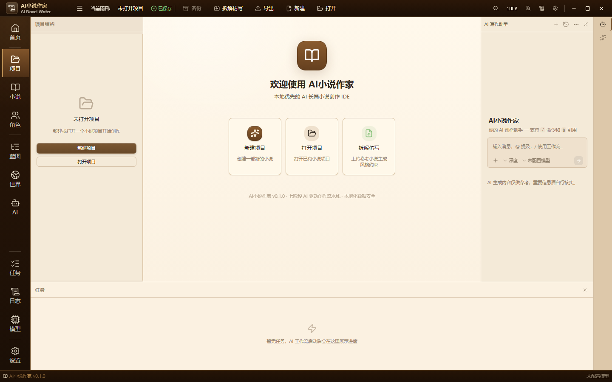

<div align="center">

[English](README_en.md) | **中文**

</div>

<p align="center">
  
</p>

<h1 align="center">AI 小说作家 / AI Novel Writer</h1>

<p align="center">
  面向长篇小说创作的本地优先桌面工作台。它把“前提 → 角色 → 世界观 → 章节蓝图 → 草稿 → 审稿 → 修稿 → 定稿”组织为一条可追溯的创作流程；模型由你自行配置，项目资料留在你的电脑上。
</p>

<p align="center">
  <a href="https://github.com/EthanYoQ/AI-Novel-Writer/releases"></a>
  <a href="https://github.com/EthanYoQ/AI-Novel-Writer/blob/master/LICENSE"></a>
  <a href="https://github.com/EthanYoQ/AI-Novel-Writer/stargazers"></a>
</p>

<p align="center">
  <a href="https://github.com/EthanYoQ/AI-Novel-Writer/releases/latest">下载最新 Windows 安装包</a>
</p>

> ## v0.4.0 重大更新
>
> 这个项目最初只是一次兴趣驱动的尝试，没想到获得了许多 Star 和真实使用反馈。为了回应，本轮对核心创作、数据、进程和安装更新链路进行了系统性 Code Review 与代码重构。
>
> v0.4.0 是一次重大更新：在正式 Release 发布后，建议安装版用户升级。正式安装包已经完成云端 Windows 构建与资格验证发布。

## 产品定位

AI 小说作家不是内置模型服务，也不是在线小说平台。它提供的是创作编排层：保存项目状态、组织提示词与上下文、管理章节蓝图和草稿版本，并把生成、审稿和修稿串起来。

你可以接入本地或云端模型；软件不会替你提供或托管模型额度。长篇创作时，系统会围绕当前章节蓝图、相关角色资料、世界观、历史摘要和可选参考文风组织上下文，而不是把整本小说塞进一次聊天记录。


```mermaid
flowchart LR
  A[创作前提] --> B[角色与世界观]
  B --> C[情节大纲与章节蓝图]
  C --> D[章节草稿]
  D --> E[审稿报告]
  E --> F[修稿与定稿]
  F --> G[下一章的项目上下文]
```

## 界面预览



## 核心能力

| 能力 | 说明 |
| --- | --- |
| 结构化创作流程 | 从前提、角色、世界观到章节蓝图、草稿、审稿、修稿和定稿，按阶段组织创作资产。 |
| 章节级生成 | 生成时围绕当前章节的蓝图和相关资料组织上下文，减少跨章跑题。 |
| 审稿与修稿 | 为草稿生成结构化审稿信息，并以报告作为修稿输入。 |
| 角色卡与项目资料 | 在项目内维护角色、世界观、蓝图、草稿和定稿；项目会话机制避免旧窗口向重新打开的项目写入数据。 |
| 参考文本与知识库 | 可导入常见文本格式作为参考资料；未配置 embedding 时仍可使用 SQLite FTS 全文检索。 |
| 批量创作任务 | 单独的批量章节创作任务可设为 1–10 章，支持暂停、取消；后处理失败会停止后续章节。 |
| 中英文界面 | 首次启动可跟随系统语言，手动选择会持久保存。 |

## v0.4.0 更新内容

| 范围 | 本轮变化 |
| --- | --- |
| 模型接入 | 新增 NovelAI 的 OpenAI-compatible 预设；保留手动填写模型标识的方式，不声称覆盖 NovelAI 原生协议或完成真实账户联调。 |
| Ollama 与向量 | Ollama 预设统一使用 OpenAI-compatible 的 `/v1` 基地址；embedding 请求会正确落到 `/v1/embeddings`。已有把地址填为 `/api` 的配置应改为 `/v1`。 |
| 输出完整性 | 识别 OpenAI `finish_reason=length` 和 Gemini `MAX_TOKENS`；草稿会在有界次数内续写，仍被截断时明确失败且不保存不完整草稿。Agent 也不会把被截断的非流式回复当成可执行内容。 |
| Agent 文件读取 | `read_file` 的指引更清楚：项目架构属于结构化数据时应使用对应读取工具，而不是猜测不存在的文件路径。 |
| 向量与 Arrow | 向量索引按实际 embedding 维度隔离，避免把不同维度或含空值的向量混入同一空间并触发 Arrow 错误。 |
| 项目与定稿安全 | 加强项目会话边界、定稿快照与发布分离，以及安装更新时对项目资料、角色卡和设置的保留。 |
| 应用更新与主页 | 首页可检查正式 GitHub Release 更新，支持稍后提醒；同时提供官方 GitHub 主页入口。第一版只做版本更新提示，不包含运营推送。 |
| Windows 构建质量 | 增加并强化 GitHub Actions 云端 Windows 安装包资格检查。它用于发布前验证构建可复现性；本候选版本的最终云端验收结果以发布记录为准。 |

## 模型配置

目前支持两类调用协议：

- **OpenAI-compatible**：适用于 OpenAI、DeepSeek、Ollama、NovelAI 预设及其他兼容 Chat Completions 的服务。
- **Gemini 原生协议**：适用于 Google Gemini 兼容端点。

“自定义 API”指的是在上述协议范围内自定义地址、模型标识和凭据；它不是任意 HTTP 协议或可执行脚本编辑器。Anthropic、Azure、KoboldAI 原生协议等不同接口需要单独的适配器，不能仅靠替换 URL 保证兼容。

### Ollama

推荐通过 Ollama 的 OpenAI-compatible 服务接入：

```text
Provider:  Ollama（本地）或自定义
Protocol:  OpenAI-compatible
Base URL:  http://127.0.0.1:11434/v1
API Key:   可留空；若界面要求，可填任意本地占位值
Model:     你的 Ollama 模型名，例如 qwen3:14b
```

向量模型也应使用 `/v1`。不要把 Base URL 写成 `http://127.0.0.1:11434/api`：`/api` 是 Ollama 的原生接口路径，不是本应用当前使用的 OpenAI-compatible embedding 路径。

### NovelAI（最小兼容支持）

设置中可选择 **NovelAI** 预设，默认地址为 `https://text.novelai.net/oa`，协议为 OpenAI-compatible。请使用自己的 Persistent API Token，并按账户实际可用模型填写模型标识。

本项目对该预设做了最小参数兼容：不向其发送标准 `response_format`，思考参数采用其兼容分支。由于维护者没有用户的 NovelAI Token，尚未进行真实账户的完整创作流程验证；遇到账号权限、模型名或接口差异时，请以 NovelAI 的账户和官方资料为准。

## 数据、隐私与边界

| 数据或行为 | 默认位置 / 去向 |
| --- | --- |
| 小说项目、角色、蓝图、草稿和定稿 | 你的项目目录与本地 SQLite 数据库。 |
| 导入的参考资料 | 保留在本地项目范围内，除非你自行把内容发送给云端模型。 |
| 本地模型请求 | 发送给你配置的本机或局域网推理服务。 |
| 云端模型请求 | 当你选择 OpenAI、DeepSeek、Gemini 或其他云端端点时，提示词和上下文会发送给该服务商。 |
| 模型配置与 API Key | 当前保存在本机用户目录 `~/.vela/models.json`；请保护操作系统账户，不要分享该文件。 |
| 应用偏好与更新延后设置 | 保存在 `~/.vela/config.json`。 |

软件本身不提供模型账号、云端生成服务或运营消息推送。联网更新检查只读取公开 GitHub Release；用户可手动检查，也可在发现更新后暂缓提醒。

## Windows 安装与更新

从 v0.3.0 起，正式版使用 Windows NSIS 安装程序：

```text
ai-novel-writer-setup-<版本号>.exe
```

1. 只从 [GitHub Releases](https://github.com/EthanYoQ/AI-Novel-Writer/releases/latest) 下载正式安装包。
2. 安装程序更新应用本身，不应删除小说项目、角色卡或已有设置；仍建议在升级前自行备份重要作品。
3. 安装后可在欢迎页使用“检查更新”。发现正式更新后，应用先下载，再提供“立即重启更新 / 稍后”的选择。
4. 旧版便携 ZIP 不能自行获得首个更新器版本，需要手动安装一次正式安装包；后续不再维护新的便携 ZIP。

当前安装程序尚未进行代码签名。Windows 可能显示发布者或信誉提示；请确认下载页面属于本项目的官方 GitHub Release 后再继续。

## 当前限制

- 不承诺任意第三方 API 都能仅靠 URL 和 Key 接入；只保证已实现协议与预设范围内的行为。
- 不替代作者的创意、事实核查或版权判断；AI 输出需要作者审阅。
- 不提供在线发布、阅读社区或云端模型账号。
- 发布安装包前仍需通过云端 Windows 构建资格检查；本 README 不是安装包已经发布的证明。

## 许可证

[GPL-3.0](LICENSE)
