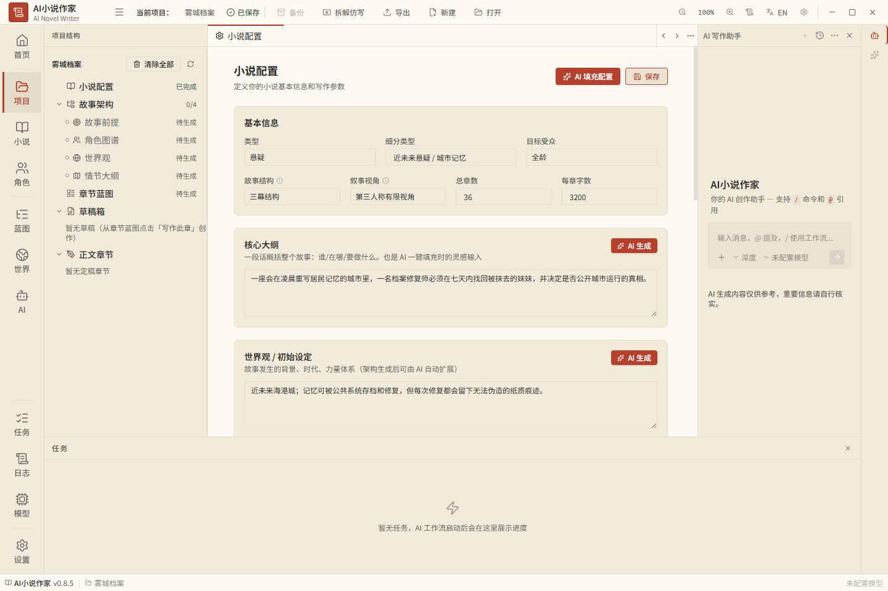

<p align="center">
  
</p>

# AI 小说作家

[English](README_en.md) | **中文**

AI 小说作家是 Windows 和 macOS 上的小说写作软件。你可以整理设定、规划章节、生成草稿，再审稿和修稿。作品保存在本机，AI 模型由你配置。

## 试用 1.2.0-Preview

本次是公开测试版，更新了写作界面、项目存储和生成恢复。维护者计划先修复测试反馈，再准备稳定版。稳定版暂无固定发布日期。

[下载 Preview 或稳定版](https://github.com/EthanYoQ/AI-Novel-Writer/releases) · [查看本次改动](.release/notes/v1.2.0-Preview.md) · [报告问题](https://github.com/EthanYoQ/AI-Novel-Writer/issues)

在 Releases 页面选择标有 `1.2.0-Preview` 的版本。`Pre-release` 表示测试版。只想使用稳定版时，选择没有该标记的版本。

测试前备份重要作品。AI 可能遗漏情节、误判审稿问题或写出不合适的内容。生成完成不等于作品合格，定稿前仍需作者检查。

## 用它完成哪些工作

- 有故事想法时，先写故事前提，再整理人物和世界设定。

- 有全书大纲时，按章节生成蓝图。蓝图记录本章目标、冲突和事件。

- 有章节蓝图时，生成草稿。查看审稿报告，选择要处理的问题，再修稿和定稿。

- 要连续写作时，启动批量任务。你可以保留待审草稿，也可以选择自动定稿模式。

- 要保存或转移作品时，导出完整项目归档。要交付正文时，导出 Markdown 或 TXT。

软件不附送模型账号或额度，也不提供在线发表和阅读社区。使用云端模型需要自己的账号和凭据。模型服务商可能按请求收费。

## 安装桌面版

从[官方 Releases 页面](https://github.com/EthanYoQ/AI-Novel-Writer/releases)下载与你的系统对应的文件。文件名中的版本号应与所选 Release 一致。

### Windows x64

1. 下载 `ai-novel-writer-setup-<版本号>.exe`。

2. 运行安装程序。

3. 启动 AI 小说作家。

Windows 安装包未进行代码签名。SmartScreen 可能显示未知发布者提示，系统策略也可能阻止运行。遇到提示时，先核对下载来源和 Release 说明。

### macOS

1. Apple Silicon Mac 下载 `ai-novel-writer-mac-arm64-<版本号>-installer.dmg`。

2. Intel Mac 下载 `ai-novel-writer-mac-x64-<版本号>-installer.dmg`。

3. 打开对应 DMG，将应用拖入“应用程序”文件夹。

4. 启动 AI 小说作家。

macOS 安装包使用 ad-hoc 签名，没有 Developer ID 签名，也未通过 Apple 公证。Gatekeeper 可能提示或阻止打开。

确认来源后，按系统提示在“系统设置”的“隐私与安全性”中允许打开。安装与安全提示的具体情况以对应 Release 说明为准。

### 以后怎样更新

稳定版更新检查不接收 Preview。试用 Preview 时，从 Releases 页面手动下载并安装。

Windows 发现稳定版更新后先提醒。你选择下载后，软件才开始下载。下载完成后，你再决定何时重启安装。

macOS 更新提醒会打开官方 Release 页面。你需要手动下载对应架构的 DMG，软件不会在应用内替换 macOS 程序。

## 从第一章开始

先准备一个可用的生成模型。界面语言与作品的写作语言可以分别设置。

1. 打开“设置”，进入“AI 生成模型”。

2. 添加模型，填写服务商地址、模型名和所需凭据。

3. 保存模型配置，并设为默认生成模型。

4. 回到首页，选择“新建作品”。

5. 填写故事想法、写作语言和章节目标。

6. 完善故事前提、人物、世界设定和情节大纲。

7. 打开“章节蓝图”，为第 1 章创建蓝图。

8. 在蓝图中选择写作操作，生成第 1 章草稿。

9. 打开草稿，运行 AI 审稿。

10. 核对报告，选择要修正的问题，再运行修稿。

11. 检查修订内容，确认后定稿。

定稿表示保存作品内的正式章节，不会向网站发表。若要交付正文，使用“导出”，选择合并 Markdown、分章 Markdown 或纯文本 TXT。

## 配置自己的模型

软件支持 OpenAI-compatible 协议和 Gemini 原生协议。OpenAI-compatible 指兼容 Chat Completions 的接口。自定义地址仍须符合所选协议。

OpenAI、DeepSeek、Ollama 和 NovelAI 等服务有对应预设。选择预设后，核对地址、模型名和账号权限。替换 URL 和 Key 不保证任意服务都兼容。

如果模型列表可用，可以在设置中获取列表。模型支持的容量和参数并不相同。输出上限只是请求设置，不保证模型生成同样数量的内容。

输入材料超过模型可用容量时，软件会明确拒绝请求。更换模型或减少本次材料后再试，不要把高输出设置当作容量证明。

### 使用本机 Ollama

先在 Ollama 中准备模型，再使用以下配置。模型名填写你本机已有的名称。

```text
Provider: Ollama
Protocol: OpenAI-compatible
Base URL: http://127.0.0.1:11434/v1
API Key: 可留空
Model: 你的本机模型名
```

向量模型也使用 `/v1` 地址。`/api` 是 Ollama 原生接口路径，不适用于本应用的 OpenAI-compatible 请求。

### 使用 NovelAI

NovelAI 预设使用 `https://text.novelai.net/oa`。填写自己的 Persistent API Token 和账号可用的模型名。

该预设只有最小兼容支持。维护者尚未验证真实 NovelAI 账号的完整写作流程。账号权限和接口差异以服务商资料及实际响应为准。

## 写长篇时怎样继续

大纲和蓝图默认每次规划 5 章，可选 1–10 章。这是单次操作范围，不是整部作品的章数上限。完成后，从下一段章节继续。

规划字数是软目标。完整内容超过目标仍会保留。正文仍超出目标时，软件会提示作者，不会仅因超长丢弃完整内容。

生成下一章时，软件带入直接上一章的完整正文。更早章节按相关内容选择。实际请求仍受模型容量限制，不能保证所有材料都能发送。

批量写作一次可选 1–10 章，支持暂停和取消。需要逐章检查时，选择“生成草稿待审”。自动定稿模式仍不保证模型内容正确。

如果某个细节必须在本章出现，可以在角色备注或世界设定中单独写一行：

```text
【第3章必现】正文明确写出主角把钥匙交给同伴。
```

审稿会按本章要求寻找正文证据。待核实不是检查通过。你需要核对原文，并决定是否将意见交给修稿。

蓝图提出新人物时，你可以创建人物、关联已有身份，或保留未解决。改名或同名不代表同一个人物，先核对再确认。

## 失败后怎样处理

生成、审稿或修稿失败时，先查看任务中保留的候选内容。按界面提供的操作恢复或保存。候选不等于已保存的草稿或定稿。

如果源蓝图或源稿已经变化，旧候选可能不能继续。查看当前版本和候选来源后再操作。恢复功能不能代替独立备份。

## 保留旧作品和备份

### 导入 v1.0.0 或 v1.1.0 项目

旧项目需要通过完整副本导入新版。导入不会调用 AI 重建作品设定，也不会在旧项目目录内转换。

1. 在旧版中保存作品。

2. 关闭旧版，以及会修改该目录的编辑或同步程序。

3. 在新版首页选择“导入旧项目副本”。

4. 选择旧项目目录和独立的新目录。

5. 导入期间保持旧目录不变。

6. 导入完成后，核对正文和创作资料。

旧目录会保留。导入后的两份作品独立保存，之后的修改不会自动同步。若导入报告资料缺失或损坏，先处理缺口，不要当作导入成功。

### 保存完整项目归档

1. 打开作品。

2. 打开“设置”中的“项目备份”。

3. 选择“导出本地存档”。

4. 将归档保存到独立的备份位置。

完整归档保留正文、历史和创作资料，并校验文件与清单。恢复会创建独立的新副本。正文导出只用于阅读或交付，不能替代完整项目归档。

### 使用 WebDAV 备份

如果你有 WebDAV 服务，可以在“项目备份”中配置账号并绑定当前作品。然后手动上传项目归档，或下载已有备份并恢复为新副本。

WebDAV 不是实时协同编辑或自动双向同步。上传会把完整项目归档发送到你配置的服务器。服务账号、存储空间和访问权限由你管理。

## 资料保存在哪里

小说正文、人物、蓝图和创作记录保存在本机项目目录。导入的参考资料也留在本机。生成请求选中的资料会随提示词发送给你配置的模型服务。

使用本机模型时，请求发送到你配置的本机或局域网服务。使用云端模型时，提示词和相关正文会发送给对应服务商。

模型凭据与应用偏好保存在系统的应用数据目录中。新版默认根目录如下，实际配置位于其中当前使用的数据子目录。

- Windows：`%APPDATA%\ai-novel-writer`。

- macOS：`~/Library/Application Support/ai-novel-writer`。

旧版 `~/.vela` 资料在升级读取后保留。不要分享含 API Key 的 `models.json`，也不要将凭据或完整私人作品附到公开问题报告中。

参考资料可以使用全文检索。若要按含义查找资料，需另配向量模型。写作 Skill 是各阶段的补充指导，可以配合提示词模板使用，但不能保证输出质量。

## 获取帮助和反馈

使用问题发到 [Discussions](https://github.com/EthanYoQ/AI-Novel-Writer/discussions)。错误和功能建议发到 [Issues](https://github.com/EthanYoQ/AI-Novel-Writer/issues)。提交前先搜索已有记录。

报告 Preview 问题时，写明版本、系统、模型服务和复现步骤。说明你期望的结果和实际结果。截图先遮住凭据及私人作品内容。

参与开发前阅读[贡献指南](CONTRIBUTING.md)。开发、领域规则和架构文档从[文档目录](docs/README.md)进入。

## DeepSeek Harness 插件

仓库另有独立的 `@ethanyoq/dsh-ai-novel-writer` 插件。`0.1.0` 预览目前冻结维护。插件不读取桌面项目，也不能替代桌面版。

如果你使用 DeepSeek Harness Web，可以安装该插件：

```sh
dsh plugin --profile web add @ethanyoq/dsh-ai-novel-writer
dsh --profile web
```

打开“小说工作台”，安装“AI 小说作家 V2” Preset。新建会话时选择该 Preset。AI 提议先进入本地表单，只有人工审核并应用 Proposal 后才写入项目。

[插件说明](plugins/dsh-ai-novel-writer/README.md) · [安装指南](plugins/dsh-ai-novel-writer/docs/official-dsh-plugin-installation.md) · [npm 包](https://www.npmjs.com/package/@ethanyoq/dsh-ai-novel-writer)

不要安装仓库根包作为 DSH 插件。桌面应用与插件分别发布，使用不同项目格式。

## 历史界面图片

以下是 v0.8.5 的旧界面截图，用于保留项目历史。1.2.0-Preview 使用 V3 界面，布局和按钮可能不同。不要按旧截图定位当前操作。

<details>
<summary>查看 v0.8.5 中文截图</summary>



</details>

## 许可证

桌面应用使用 [GPL-3.0](LICENSE)。DeepSeek Harness 插件按其独立的 [MIT 许可证](plugins/dsh-ai-novel-writer/LICENSE)发布。
