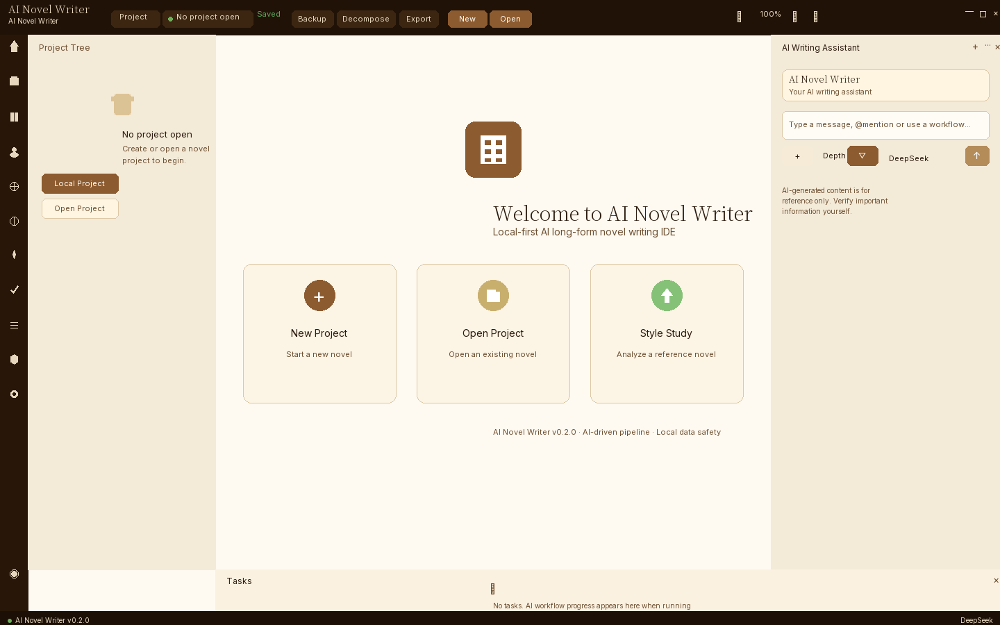
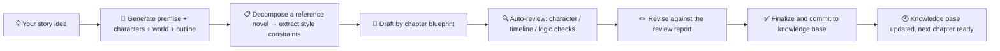
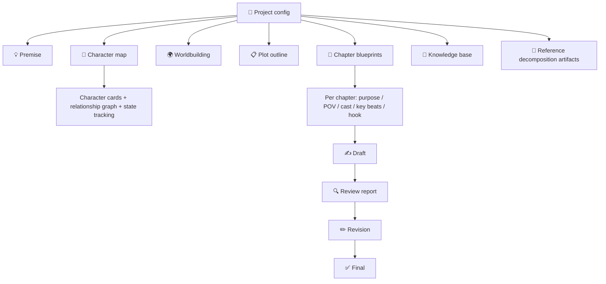

<div align="center">

**English** | [中文](README.md)

</div>

<p align="center">
  
</p>

<h1 align="center">AI Novel Writer / AI 小说作家</h1>

<p align="center">
  A local-first desktop writing tool for long-form fiction. Turns "premise → characters → world → chapter blueprints → draft → review → revision → final" into a memory-aware production line: the AI writes one chapter at a time, always sees the blueprint, and every chapter gets reviewed.
</p>

<p align="center">
  Search intent: <strong>AI novel writing</strong>, <strong>AI novel writer</strong>, <strong>local model writing</strong>, <strong>Ollama fiction</strong>, <strong>long-form AI</strong>, <strong>NSFW writing</strong>, <strong>AI writing tool</strong>, <strong>local-first writing</strong>.
</p>

<p align="center">
  <a href="https://github.com/EthanYoQ/AI-Novel-Writer/releases"></a>
  <a href="https://github.com/EthanYoQ/AI-Novel-Writer/blob/master/LICENSE"></a>
  <a href="https://github.com/EthanYoQ/AI-Novel-Writer/stargazers"></a>
</p>

<p align="center">
  <a href="https://github.com/EthanYoQ/AI-Novel-Writer/releases/latest">Download latest Windows build</a>
</p>

<p align="center">
  
</p>

---

## 🎯 In one sentence

AI Novel Writer is not a chatbot, and not a simple AI writing assistant.

It does one thing: **turn the long-form fiction process from "arguing with AI in a chat window" into a structured, memory-aware, review-driven pipeline. You bring the ideas; the AI brings the labor. You change a character's motivation and every affected blueprint is auto-flagged. You finish a chapter and a review report automatically points out what broke.**

Built for these scenarios:

| Scenario | The old way | AI Novel Writer does it for you |
| --- | --- | --- |
| 📚 Writing a novel from scratch | Hundreds of chat rounds with ChatGPT; character traits, timelines, and foreshadowing all collapse | Character cards + outline + chapter blueprints interlock; the AI writes only this chapter and never changes established lore |
| 🔓 Writing restricted content | Cloud APIs refuse even fictional violence; adult/NSFW content is completely blocked | Local models (abliterated / uncensored) directly, including **NSFW / adult-oriented** fiction and any other fictional topic |
| 🎨 Mimicking a favorite novel | Repeatedly telling AI "make it feel like that book" without knowing the exact recipe | Import any format (TXT / Markdown / EPUB / HTML and more), auto-decompose style, pacing, and character formula; the AI follows the recipe |
| 🧩 Changing lore mid-project | Manually scrolling back through dozens of chapters to find affected references | Edit a character card → all blueprints that reference it are auto-flagged; edit worldbuilding → all chapters auto-check consistency |
| 🔧 Revision after drafting | Self-proofing for timeline contradictions and character drift | Auto-generated review report per chapter (character state, timeline, setting conflicts, logic holes) drives a revision pass |

---

## 🧭 How it works



Before each draft, the AI receives: this chapter's blueprint + relevant character cards + worldbuilding snippet + style constraints + history summary. It **never forgets the foreshadowing planted in chapter 5**.

---

## 🖥️ UI preview

### Main window: project tree + welcome page + AI writing assistant


---

## ✨ Core capabilities

| Icon | Capability | Problem it solves |
| --- | --- | --- |
| 🔓 | Local models + uncensored writing | Direct local model (Ollama / LM Studio / vLLM) connection, bypassing cloud safety guardrails; supports **NSFW / adult-oriented** fiction and any fictional topic |
| 🎨 | Reference novel decomposition & mimic | Import any format (TXT / Markdown / EPUB / HTML and more), auto-split chapters, infer settings, extract characters, output style constraints; format-agnostic |
| 🧩 | Character / outline / blueprint interlock | Character cards, worldbuilding, and chapter blueprints cross-reference; edit a card and all linked blueprints auto-flag; structure solves consistency |
| 📑 | Blueprint-driven drafting | AI writes only this chapter, reading the chapter blueprint + relevant character cards + history summary each time; prevents scope creep |
| 🔍 | Auto-review reports | After each draft, a structured review report (character state, timeline, setting conflicts, logic holes) is generated and drives a revision pass |
| 📖 | Knowledge base retrieval | Import TXT / Markdown / EPUB / HTML and more; vector retrieval when an embedding is configured, SQLite FTS fallback otherwise |
| 🧭 | Story architecture generation | Step-by-step generation of premise, character map, worldbuilding, and plot outline; scaffold a full novel from a single sentence |
| 🔌 | Model freedom | Any OpenAI-compatible endpoint (local or cloud), including abliterated / uncensored weights |
| 🌐 | Chinese / English UI | Follows system locale on first launch; manual choice persists |

---

## 🔓 Local models. Zero content policy. (Including NSFW / adult fiction)

Cloud providers will not make an exception just because you are writing fiction — **your protagonist gets hurt in chapter 4, or you write an intimate adult scene, and the model refuses to continue**. Local models do not have that problem:

| Connection | Best for |
| --- | --- |
| **Ollama** (recommended) | One-line `ollama pull qwen3:14b-abliterated` and you're set; supports **NSFW / adult / violent / horror** fiction and any fictional topic |
| LM Studio / vLLM / KoboldCpp | Local inference servers, OpenAI-compatible protocol; you choose the weights |
| OpenAI / DeepSeek / Gemini | Cloud fallback when you don't want to run a model locally (still subject to cloud content policies) |
| Custom OpenAI-compatible endpoint | Corporate proxy, internal inference service, or your own rig |

> Set `defaultModelId` in `~/.vela/config.json` to your local model name. Project data lives entirely on disk (SQLite + project folder). **You can write offline.**

---

## 🎨 Decompose any format. Mimic its voice.

Any format. TXT, Markdown, EPUB, HTML… even text copied from a web page. Drop it into **Decompose & Mimic**:

1. Auto-split into chapters (format-aware chapter boundary detection)
2. Infer global settings (genre, POV, pacing, style)
3. Extract per-character cards (background, motivation, speech habits)
4. Generate a blueprint for every chapter (purpose, cast, key beats, hooks)
5. **Output a style-constraint document** — attach it to your own project and the AI writes *in that voice* from then on

You are not teaching the model from scratch. You are transferring the **feel** of a book into your own generation pipeline. Love that book's rhythm? Love that character's dialogue style? Decompose it and turn it into a reusable writing recipe.

---

## 🧩 Structured memory. The model never forgets chapter 5.

The hardest engineering problem in long-form AI fiction is **consistency**. AI Novel Writer's answer is to turn every creative asset into a **referenceable structure**:



- **Edit a character card** → every blueprint that references them is auto-flagged
- **Finish a chapter draft** → knowledge base auto-indexes it; later chapters can search it
- **Before each generation** → assemble: this-chapter blueprint + relevant character cards + worldbuilding snippet + style constraints + history summary
- **After each draft** → produce a structured **review report** (character state, timeline, setting conflicts, in-chapter logic) and use it to drive a **revision pass**

The model only ever sees what it needs to see, but **nothing important gets forgotten**.

---

## 🔐 Data & privacy

| Data | Default location / destination |
| --- | --- |
| 📂 Novel project data | Local project folder + SQLite database, fully offline |
| 📖 Imported reference novels | Local project folder, never uploaded |
| ✍️ Generated drafts / revisions / finals | Local project folder, never uploaded |
| 🤖 Local model conversations | Sent to local Ollama / LM Studio / vLLM services, never leaves the machine |
| ☁️ Cloud API conversations | If you configure OpenAI / DeepSeek / Gemini etc., prompts and context are sent to that provider |
| 🔑 API keys / config | Stored in local `~/.vela/config.json`, deletable manually |

You can switch between local and cloud models at any time in settings. **Local-first. Data stays on your machine.**

---

## ⚙️ Recommended configuration

| Type | Recommendation | Notes |
| --- | --- | --- |
| 🤖 Default model (local) | Ollama + qwen3:14b-abliterated | 14B class, fits 6GB VRAM, excellent Chinese writing; abliterated weight supports uncensored creation |
| 🤖 Alternative model (local) | LM Studio / vLLM | Choose other models; good for users with more VRAM |
| ☁️ Cloud fallback | DeepSeek / OpenAI / Gemini | When you don't want to run locally; still subject to cloud content policies |
| 💾 Knowledge base embedding | Default: none needed | Without embedding, SQLite FTS full-text search covers most scenarios |

---

## 🚀 30-second setup with Ollama

```bash
# 1) Pull a local model (Qwen3 14B quantized — fits 6GB VRAM)
ollama pull qwen3:14b

# 2) In AI Novel Writer → Model settings, fill in:
#    Provider:        custom
#    Protocol:        OpenAI-compatible
#    Base URL:        http://127.0.0.1:11434/v1
#    API key:         ollama
#    Model:           qwen3:14b
#    (or use a community abliterated weight of your choice)

# 3) New project → write a one-line premise → let the AI generate
#    characters / world / blueprints → start chapter 1
```

---

## 📦 Windows install

The release is a zipped application folder:

```text
AI-Novel-Writer-0.2.1-windows-x64.zip
└─ AI-Novel-Writer/
   ├─ AI Novel Writer.exe
   ├─ resources/
   └─ Electron runtime files...
```

1. Download `AI-Novel-Writer-0.2.1-windows-x64.zip` from [GitHub Releases](https://github.com/EthanYoQ/AI-Novel-Writer/releases/tag/v0.2.1)
2. **Extract it fully** to any directory
3. Launch `AI Novel Writer.exe`

> ⚠️ Do not double-click the EXE inside the zip — Electron needs the relative `resources/` path. Extract first, then run.

---

## 🧱 Product boundaries

AI Novel Writer deliberately does not do these things:

| Not doing | Reason |
| --- | --- |
| ❌ Auto-generate an entire book | Does not replace your creativity. The AI writes only "blueprints you approved", never generates full chapters out of thin air |
| ❌ Online novel platform | Not a publishing/reading community; it's a writing tool |
| ❌ Chatbot | Not an open-ended chat; it's a structured creation pipeline |
| ❌ Local ASR-first | Currently text-input focused; voice input is a future extension |
| ❌ General writing assistant | Focused on long-form fiction (100k+ words), not short essays / emails / blogs |

---

## ⭐ Star

If this project helps you, give it a Star on GitHub to support continued development.

## License

[GPL-3.0](LICENSE)
