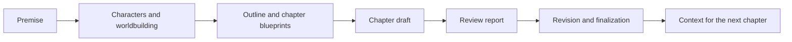
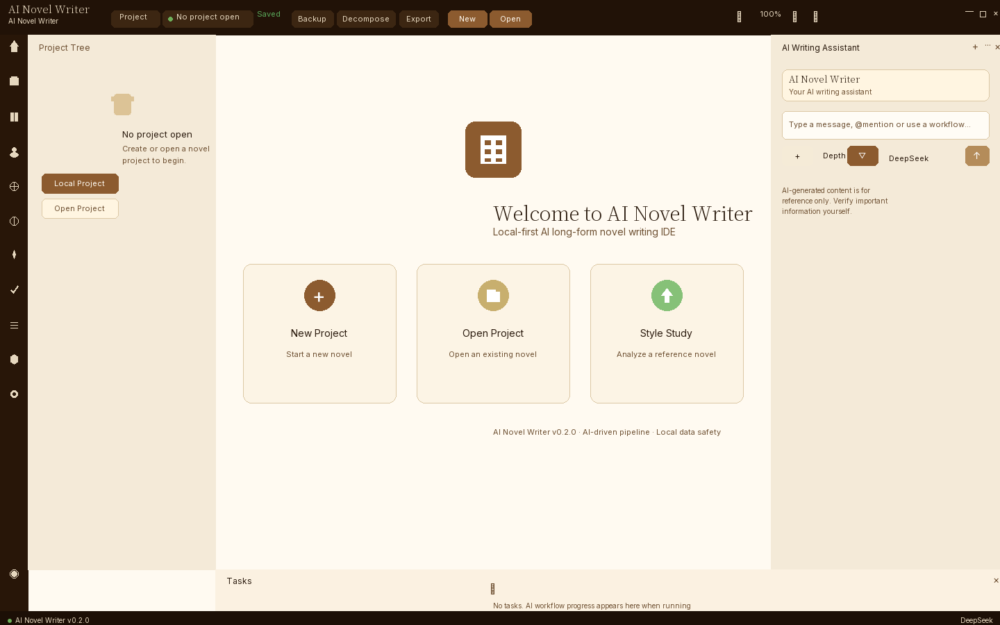

<div align="center">

**English** | [中文](README.md)

</div>

<p align="center">
  
</p>

<h1 align="center">AI Novel Writer / AI 小说作家</h1>

<p align="center">
  A local-first desktop workspace for long-form fiction. It organizes “premise → characters → worldbuilding → chapter blueprints → draft → review → revision → final” as a traceable writing workflow. You configure the model; your project material stays on your computer.
</p>

<p align="center">
  <a href="https://github.com/EthanYoQ/AI-Novel-Writer/releases"></a>
  <a href="https://github.com/EthanYoQ/AI-Novel-Writer/tree/master/plugins/dsh-ai-novel-writer"></a>
  <a href="https://github.com/EthanYoQ/AI-Novel-Writer/blob/master/LICENSE"></a>
  <a href="https://github.com/EthanYoQ/AI-Novel-Writer/stargazers"></a>
</p>

<p align="center">
  <a href="https://github.com/EthanYoQ/AI-Novel-Writer/releases/latest">Download desktop (Windows / macOS)</a> · <a href="https://www.npmjs.com/package/@ethanyoq/dsh-ai-novel-writer">Install the DeepSeek Harness Web plugin</a>
</p>

<p align="center">
  
</p>

> ## v0.8.5 authoring loop and three-architecture desktop release
>
> [v0.8.5](https://github.com/EthanYoQ/AI-Novel-Writer/releases/tag/v0.8.5) completes the human-controlled loop from writing through finalization, and brings macOS Apple Silicon and Intel installers into one traceable release contract:
>
> - **Controlled authoring models** — Single-chapter, batch, and review-driven revision flows can explicitly select and freeze the model for that run instead of silently falling back to the global default. An incomplete model response reports its actual terminal reason, so a policy block is no longer presented as a generic unfinished workflow.
> - **Human review to revision** — AI review items can be edited, ignored, restored, or supplemented. Confirmation persists an immutable snapshot; revision creates a pending merge revision from that confirmed list, leaving the final diff merge to the author.
> - **Writing and project reliability** — Repairs cover the chapter writing entry, post-finalization status, structured JSON recovery, and relationship-graph editing boundaries. Incomplete or unconfirmed material is not persisted as completed work.
> - **Appearance and platforms** — The independent themes (`light`, `galaxy`, `paper`, `dark`) and interface skins (`classic`, `anime`, `custom`) remain available. macOS ARM64 and x64 each have separate qualification contracts, builds, and receipts.
>
> One Release uses the exact seven-asset contract: `ai-novel-writer-setup-0.8.5.exe`, `ai-novel-writer-setup-0.8.5.exe.blockmap`, `latest.yml`, `ai-novel-writer-mac-arm64-0.8.5-installer.dmg`, `ai-novel-writer-mac-arm64-0.8.5-installer.dmg.sha256`, `ai-novel-writer-mac-x64-0.8.5-installer.dmg`, and `ai-novel-writer-mac-x64-0.8.5-installer.dmg.sha256`. The Windows installer is not code-signed; both macOS installers are ad-hoc or unsigned and not notarized, so their platform security prompts may require manual confirmation on first launch.


## DeepSeek Harness plugin edition (developer preview)

In addition to the Windows and macOS desktop editions, the [plugin directory](https://github.com/EthanYoQ/AI-Novel-Writer/tree/master/plugins/dsh-ai-novel-writer) contains the `@ethanyoq/dsh-ai-novel-writer` `0.1.0` developer preview. It brings project settings, characters, story blueprints, chapter blueprints, and chapter drafts into DeepSeek Harness Web, saving one asset at a time through the conversation's approval card. The plugin uses its own Harness novel-project format and does not read desktop `.vela` projects.

The plugin is not part of the desktop application's formal Release, but it is published as a separate npm package with its own lockfile, CI, and MIT license; the repository root remains the GPL-3.0 desktop application. Install it into the DeepSeek Harness `web` profile:

```sh
dsh plugin --profile web add @ethanyoq/dsh-ai-novel-writer
dsh --profile web
```

For development, install it from source in the plugin directory:

```sh
git clone https://github.com/EthanYoQ/AI-Novel-Writer.git
cd AI-Novel-Writer/plugins/dsh-ai-novel-writer
pnpm install
pnpm run build
dsh plugin --profile web add .
dsh --profile web
```

To install an immutable local build instead of a live source link, pack and install the tarball:

```sh
pnpm pack --pack-destination ../../.runtime/.cache
cd ../..
dsh plugin --profile web add ./.runtime/.cache/ethanyoq-dsh-ai-novel-writer-0.1.0.tgz
dsh --profile web
```

After Web starts, open **Novel Workbench** and install the **AI 小说作家** Preset, then create a new Session with that Preset. Model-generated changes appear as the native Harness approval card in the conversation; the plugin writes and backfills the workbench only after one **Allow once** approval. See the [plugin README](plugins/dsh-ai-novel-writer/README.md) for features, project format, qualification coverage, and removal. Do not run `dsh plugin add github:EthanYoQ/AI-Novel-Writer`: the repository root package is the desktop application, not an activatable DSH bundle.


## What this product is

AI Novel Writer is not a hosted model service or an online fiction platform. It is the orchestration layer for a writing project: it keeps project state, organizes prompts and context, manages blueprints and draft versions, and connects generation, review, and revision.

You may connect local or cloud models; the app does not provide or host model quotas. For long-form work, it assembles the current chapter blueprint, relevant character material, worldbuilding, history summaries, and optional style references instead of putting an entire novel into one chat transcript.


```mermaid
flowchart LR
  A[Premise] --> B[Characters and worldbuilding]
  B --> C[Outline and chapter blueprints]
  C --> D[Chapter draft]
  D --> E[Review report]
  E --> F[Revision and finalization]
  F --> G[Context for the next chapter]
```

## Interface preview



## Core capabilities

| Capability | What it does |
| --- | --- |
| Structured writing workflow | Organizes premises, characters, worldbuilding, blueprints, drafts, reviews, revisions, and finals by stage. |
| Chapter-level generation | Builds context around the current chapter blueprint and related material to reduce cross-chapter drift. |
| Review and revision | Produces structured review information for a draft and uses that report as revision input. |
| Character cards and project material | Maintains characters, worldbuilding, blueprints, drafts, and finals in the project. Project sessions prevent an old window from writing into a newly reopened project. |
| Reference text and knowledge base | Imports common text formats as reference material. SQLite FTS remains available when no embedding model is configured. |
| Batch writing task | A separate batch chapter task supports 1–10 chapters, pause, and cancel; downstream processing failure stops later chapters. |
| Chinese and English UI | The first launch can follow the system locale; a manual choice is persisted. |

## Model configuration

The app currently supports two request protocols:

- **OpenAI-compatible** — for OpenAI, DeepSeek, Ollama, the NovelAI preset, and other compatible Chat Completions services.
- **Native Gemini** — for Google Gemini-compatible endpoints.

“Custom API” means a configurable URL, model identifier, and credential within those protocols. It is not an arbitrary HTTP protocol editor or a place to run user-supplied scripts. Protocols such as Anthropic Messages, Azure OpenAI, or native KoboldAI require dedicated adapters rather than a URL swap.

### Ollama

Use Ollama through its OpenAI-compatible service:

```text
Provider:  Ollama (local) or Custom
Protocol:  OpenAI-compatible
Base URL:  http://127.0.0.1:11434/v1
API key:   may be left blank; if the UI requires one, use a local placeholder
Model:     your Ollama model name, for example qwen3:14b
```

Embedding models should also use `/v1`. Do not set the Base URL to `http://127.0.0.1:11434/api`: `/api` is Ollama's native path, not the OpenAI-compatible embedding path used by this application.

### NovelAI (minimal compatibility support)

Choose the **NovelAI** preset in settings. Its default address is `https://text.novelai.net/oa` and it uses the OpenAI-compatible protocol. Use your own Persistent API Token and enter a model identifier available to your account.

The preset applies minimal parameter compatibility: it does not send standard `response_format`, and its thinking option follows the compatibility branch. The maintainer does not possess a user's NovelAI Token, so a complete real-account writing workflow has not been verified. Account permissions, model identifiers, and API behavior remain subject to NovelAI's own documentation and account response.

## Data, privacy, and boundaries

| Data or behavior | Default location / destination |
| --- | --- |
| Novel projects, characters, blueprints, drafts, and finals | Your project folder and local SQLite database. |
| Imported reference material | Remains within the local project scope unless you choose to send it to a cloud model. |
| Local-model requests | Sent to the local or LAN inference service you configure. |
| Cloud-model requests | Prompts and context go to the provider you choose, such as OpenAI, DeepSeek, Gemini, or another cloud endpoint. |
| Model configuration and API keys | Currently stored in the local user-profile file `~/.vela/models.json`; protect your OS account and do not share this file. |
| App preferences and deferred-update settings | Stored in `~/.vela/config.json`. |

The app does not provide model accounts, cloud generation, or operational-message pushes. Update checks read public GitHub Releases only; users can check manually and defer a discovered version reminder.

## Installation and updates

### Windows x64

Formal releases use a Windows NSIS installer:

```text
ai-novel-writer-setup-<version>.exe
```

1. Download formal installers only from [GitHub Releases](https://github.com/EthanYoQ/AI-Novel-Writer/releases/latest).
2. The installer updates the application and should not delete novel projects, character cards, or existing settings. Back up important work before any upgrade.
3. After installation, use **Check for updates** on the welcome page. When a formal update is found, the app downloads it and offers **Restart and update / Later**.
4. Older portable ZIP builds cannot obtain their first updater automatically. Install a formal installer manually once; new portable ZIP releases are no longer maintained.

The installer is not code-signed at present. Windows may show publisher or reputation warnings; continue only after confirming that the download page is this repository's official GitHub Release.

### macOS (Apple Silicon and Intel)

Download the installer matching your Mac architecture from [GitHub Releases](https://github.com/EthanYoQ/AI-Novel-Writer/releases/latest):

```text
ai-novel-writer-mac-arm64-<version>-installer.dmg
ai-novel-writer-mac-x64-<version>-installer.dmg
```

1. `arm64` supports Apple Silicon Macs (M1, M2, M3, M4, and later); `x64` supports Intel Macs.
2. Drag the app from the DMG to Applications. This macOS release has no in-app updater; download future versions manually from the same Release page.
3. Neither installer has a Developer ID signature or notarization (ARM64 is ad-hoc signed; x64 is unsigned). If Gatekeeper blocks it, confirm that the source is this repository's official GitHub Release, then Control-click the app in Finder and choose **Open**, or allow it in **System Settings → Privacy & Security**.

## Current limits

- A URL and key do not guarantee support for every third-party API; only implemented protocols and presets are in scope.
- The app does not replace authorial judgment, fact checking, or copyright decisions. Review AI output before using it.
- It does not provide online publishing, a reading community, or cloud-model accounts.
- Formal installers are built in GitHub Actions. Windows, macOS ARM64, and macOS x64 candidates each pass their own qualification before they are listed in one GitHub Release.

## License

[GPL-3.0](LICENSE)
