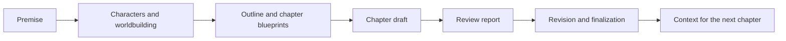

<div align="center">

**English** | [中文](README.md)

</div>

<p align="center">
  
</p>

<h1 align="center">AI Novel Writer / AI 小说作家</h1>

<p align="center">
  A local-first desktop workspace for long-form fiction. It organizes “premise → characters → worldbuilding → chapter blueprints → draft → review → revision → final” as a traceable writing workflow. You configure the model; your project material stays on your computer.
</p>

<p align="center">
  <a href="https://github.com/EthanYoQ/AI-Novel-Writer/releases"></a>
  <a href="https://github.com/EthanYoQ/AI-Novel-Writer/blob/master/LICENSE"></a>
  <a href="https://github.com/EthanYoQ/AI-Novel-Writer/stargazers"></a>
</p>

<p align="center">
  <a href="https://github.com/EthanYoQ/AI-Novel-Writer/releases/latest">Download the latest Windows and macOS ARM64 installers</a>
</p>

> ## v0.7.0 major update
>
> [v0.7.0](https://github.com/EthanYoQ/AI-Novel-Writer/releases/tag/v0.7.0) is a major update to release reliability and interface appearance. It provides classic, original anime, and custom image skins, with classic retained as the default appearance. Custom images accept only PNG or JPEG; the main process selects, validates, and copies them into application data. A safe fallback returns to classic on import or read failure without exposing a local absolute path to the renderer. On Windows, “Restart and update now” now installs silently and relaunches the new version automatically. This release also adds formal-Release in-app-update end-to-end qualification for the path from an installed formal version to a newer formal version. Windows x64 and macOS ARM64 cloud qualification include a cross-platform packaged-skin smoke covering the built-in asset and custom-skin recovery in isolated user data.
>
> This release provides both Windows x64 and macOS Apple Silicon (ARM64) installers in one Release asset list. The Windows x64 installer supports in-app updates but is not code-signed. The macOS ARM64 package is unsigned and not notarized, and future macOS updates require a manual download from the Release page. Windows security prompts or Gatekeeper may require manual confirmation on first launch.

## What this product is

AI Novel Writer is not a hosted model service or an online fiction platform. It is the orchestration layer for a writing project: it keeps project state, organizes prompts and context, manages blueprints and draft versions, and connects generation, review, and revision.

You may connect local or cloud models; the app does not provide or host model quotas. For long-form work, it assembles the current chapter blueprint, relevant character material, worldbuilding, history summaries, and optional style references instead of putting an entire novel into one chat transcript.


```mermaid
flowchart LR
  A[Premise] --> B[Characters and worldbuilding]
  B --> C[Outline and chapter blueprints]
  C --> D[Chapter draft]
  D --> E[Review report]
  E --> F[Revision and finalization]
  F --> G[Context for the next chapter]
```

## Interface preview


## Core capabilities

| Capability | What it does |
| --- | --- |
| Structured writing workflow | Organizes premises, characters, worldbuilding, blueprints, drafts, reviews, revisions, and finals by stage. |
| Chapter-level generation | Builds context around the current chapter blueprint and related material to reduce cross-chapter drift. |
| Review and revision | Produces structured review information for a draft and uses that report as revision input. |
| Character cards and project material | Maintains characters, worldbuilding, blueprints, drafts, and finals in the project. Project sessions prevent an old window from writing into a newly reopened project. |
| Reference text and knowledge base | Imports common text formats as reference material. SQLite FTS remains available when no embedding model is configured. |
| Batch writing task | A separate batch chapter task supports 1–10 chapters, pause, and cancel; downstream processing failure stops later chapters. |
| Chinese and English UI | The first launch can follow the system locale; a manual choice is persisted. |

## What changes in v0.4.0

| Area | Change in this cycle |
| --- | --- |
| Model connections | Adds a NovelAI OpenAI-compatible preset. Model identifiers remain user-entered; this does not claim NovelAI native-protocol coverage or real-account integration testing. |
| Ollama and embeddings | The Ollama preset uses the OpenAI-compatible `/v1` base URL, and embedding calls target `/v1/embeddings`. Existing `/api` configurations should be changed to `/v1`. |
| Output completeness | Detects OpenAI `finish_reason=length` and Gemini `MAX_TOKENS`. Drafts continue for a bounded number of rounds; if they still end truncated, they fail clearly and are not saved. The Agent also does not treat a truncated non-stream response as executable content. |
| Agent file reading | `read_file` guidance now distinguishes structured project data from guessed file paths and points agents to the appropriate reading tool. |
| Vectors and Arrow | Vector indexes are isolated by their actual embedding dimension, avoiding mixed dimensions or null-bearing vectors that can trigger Arrow errors. |
| Project and finalization safety | Strengthens project-session boundaries, separates finalization snapshots from publication, and preserves project material, character cards, and settings during application updates. |
| In-app updates and homepage | The welcome page can check formal GitHub Releases and defer reminders; it also exposes the official GitHub homepage. The first version only communicates version updates, not operational or marketing pushes. |
| Windows build quality | Adds and hardens GitHub Actions cloud qualification for the Windows installer. It is a pre-release reproducibility check; the final cloud-verification result for this candidate is recorded with the release, not promised here. |

## Model configuration

The app currently supports two request protocols:

- **OpenAI-compatible** — for OpenAI, DeepSeek, Ollama, the NovelAI preset, and other compatible Chat Completions services.
- **Native Gemini** — for Google Gemini-compatible endpoints.

“Custom API” means a configurable URL, model identifier, and credential within those protocols. It is not an arbitrary HTTP protocol editor or a place to run user-supplied scripts. Protocols such as Anthropic Messages, Azure OpenAI, or native KoboldAI require dedicated adapters rather than a URL swap.

### Ollama

Use Ollama through its OpenAI-compatible service:

```text
Provider:  Ollama (local) or Custom
Protocol:  OpenAI-compatible
Base URL:  http://127.0.0.1:11434/v1
API key:   may be left blank; if the UI requires one, use a local placeholder
Model:     your Ollama model name, for example qwen3:14b
```

Embedding models should also use `/v1`. Do not set the Base URL to `http://127.0.0.1:11434/api`: `/api` is Ollama's native path, not the OpenAI-compatible embedding path used by this application.

### NovelAI (minimal compatibility support)

Choose the **NovelAI** preset in settings. Its default address is `https://text.novelai.net/oa` and it uses the OpenAI-compatible protocol. Use your own Persistent API Token and enter a model identifier available to your account.

The preset applies minimal parameter compatibility: it does not send standard `response_format`, and its thinking option follows the compatibility branch. The maintainer does not possess a user's NovelAI Token, so a complete real-account writing workflow has not been verified. Account permissions, model identifiers, and API behavior remain subject to NovelAI's own documentation and account response.

## Data, privacy, and boundaries

| Data or behavior | Default location / destination |
| --- | --- |
| Novel projects, characters, blueprints, drafts, and finals | Your project folder and local SQLite database. |
| Imported reference material | Remains within the local project scope unless you choose to send it to a cloud model. |
| Local-model requests | Sent to the local or LAN inference service you configure. |
| Cloud-model requests | Prompts and context go to the provider you choose, such as OpenAI, DeepSeek, Gemini, or another cloud endpoint. |
| Model configuration and API keys | Currently stored in the local user-profile file `~/.vela/models.json`; protect your OS account and do not share this file. |
| App preferences and deferred-update settings | Stored in `~/.vela/config.json`. |

The app does not provide model accounts, cloud generation, or operational-message pushes. Update checks read public GitHub Releases only; users can check manually and defer a discovered version reminder.

## Installation and updates

### Windows x64

Formal releases use a Windows NSIS installer:

```text
ai-novel-writer-setup-<version>.exe
```

1. Download formal installers only from [GitHub Releases](https://github.com/EthanYoQ/AI-Novel-Writer/releases/latest).
2. The installer updates the application and should not delete novel projects, character cards, or existing settings. Back up important work before any upgrade.
3. After installation, use **Check for updates** on the welcome page. When a formal update is found, the app downloads it and offers **Restart and update / Later**.
4. Older portable ZIP builds cannot obtain their first updater automatically. Install a formal installer manually once; new portable ZIP releases are no longer maintained.

The installer is not code-signed at present. Windows may show publisher or reputation warnings; continue only after confirming that the download page is this repository's official GitHub Release.

### macOS Apple Silicon (ARM64)

Download this file from [GitHub Releases](https://github.com/EthanYoQ/AI-Novel-Writer/releases/latest):

```text
ai-novel-writer-mac-arm64-<version>-installer.dmg
```

1. This package supports Apple Silicon Macs only (M1, M2, M3, M4, and later ARM64 devices); no Intel Mac installer is provided.
2. Drag the app from the DMG to Applications. This macOS release has no in-app updater; download future versions manually from the same Release page.
3. This package is unsigned and not notarized. If Gatekeeper blocks it, confirm that the source is this repository's official GitHub Release, then Control-click the app in Finder and choose **Open**, or allow it in **System Settings → Privacy & Security**.

## Current limits

- A URL and key do not guarantee support for every third-party API; only implemented protocols and presets are in scope.
- The app does not replace authorial judgment, fact checking, or copyright decisions. Review AI output before using it.
- It does not provide online publishing, a reading community, or cloud-model accounts.
- Formal installers are built in GitHub Actions. Windows and macOS ARM64 candidates each pass their own qualification before both are listed in one GitHub Release.

## License

[GPL-3.0](LICENSE)
