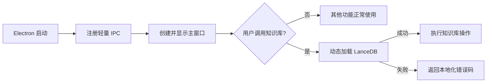

# AI Novel Writer v0.2.0：启动修复、界面国际化、README 与发布设计

日期：2026-07-19
状态：待用户审阅
目标版本：`v0.2.0`

## 1. 背景与已验证问题

当前 GitHub 上有三个未关闭 Issue：

- Issue #2「无法运行」：Windows 发布包启动时，Electron 主进程加载 `@lancedb/lancedb`，因缺少 `@lancedb/lancedb-win32-x64-msvc` 原生绑定而直接崩溃。
- Issue #3「服务器启动失败」：截图显示旧品牌 Mythpen 的启动页和 `Load failed`。当前构建链未清理旧产物，且主进程在创建窗口前同步加载知识库原生依赖，二者都可能让用户看到陈旧或不可用的启动界面。
- Issue #4「启动失败了，Error」：与 Issue #2 是同一条原生绑定缺失故障链。

本地已完成的复现证据：

- `pnpm install --frozen-lockfile`、类型检查和 27 个测试文件 / 94 个测试均通过。
- 当前 `master` 能生成 Windows unpacked 包，但 `resources/app.asar.unpacked` 中没有 LanceDB 的 Windows `.node` 原生绑定。
- `app.asar` 内存在 `@lancedb/lancedb` JavaScript 包，因此发布包会在主进程启动阶段执行到绑定加载，再以 Issue 截图中的错误崩溃。
- `npm ci` 因 `package-lock.json` 与 `package.json` 严重不同步而失败；仓库实际可重复安装路径是 pnpm。

结论：这是“源码测试通过、发布产物不可运行”的打包缺陷，不能只靠增加单元测试解决。

## 2. 目标与非目标

### 2.1 目标

1. 修复三个 Issue 对应的 Windows 启动故障，保证主窗口能启动。
2. 即使知识库原生模块未来再次不可用，也不能拖垮整个应用；仅知识库相关操作失败，并显示可理解的本地化错误。
3. 增加简体中文 / English 界面切换，首次启动跟随操作系统语言，用户选择后持久化。
4. 国际化只覆盖应用界面、系统提示和错误信息。
5. 重写中英文 README，并加入原创主题图和真实产品截图。
6. 以 `v0.2.0` 发布经过验证的 Windows x64 ZIP，回复并关闭已经解决的三个 Issue。

### 2.2 非目标

- 不翻译或自动改写内置创作 Prompt、文体模板、小说内容和生成语言。
- 不增加新的本地模型或云端模型依赖。
- 不重构小说生成业务流程，不改变现有项目数据格式。
- 本版本不承诺 macOS / Linux 安装包；跨平台代码应保持可安装，但发布验证范围是 Windows x64。
- README 主题图使用静态 SVG，不制作 GIF 或视频。

## 3. 方案选择

采用“发布包修复 + 运行时隔离”的双保险方案。

### 3.1 备选方案

1. **只修打包配置**：改动小，但原生依赖再次异常时仍会导致整个主进程崩溃。
2. **打包修复并延迟加载知识库（采用）**：既修当前根因，又让主应用与可选原生能力解耦；验证工作更多，但最符合桌面应用可靠性要求。
3. **移除 LanceDB / 重写知识库**：风险和范围过大，不适合故障修复版本。

### 3.2 核心原则

- 可重复构建优先于“本机恰好能构建”。
- 应用可启动是一级能力，知识库是可降级能力。
- 任何“已修复”结论必须由最终 ZIP 内部结构和真实 EXE 启动共同证明。
- 语言状态只有一个事实源，渲染进程和主进程使用同一组语言代码和消息键。

## 4. 技术设计

### 4.1 依赖与构建链

仓库统一使用 pnpm：

- 在 `package.json` 固定 `packageManager` 版本。
- 删除已经失真的 `package-lock.json`，文档和打包脚本统一改为 pnpm 命令。
- 使用 `pnpm-lock.yaml` 和 `--frozen-lockfile` 作为发布安装门禁。
- 将 Windows LanceDB 原生包声明为明确的可选生产依赖，使 electron-builder 能从 pnpm 依赖图中收集它；非 Windows 平台安装时不会因 `os/cpu` 限制失败。
- 保留并收紧 `asarUnpack`，确保 `.node` 文件位于 `app.asar.unpacked`，而不是被压入 ASAR。
- Windows 打包前只清理经解析并确认位于仓库内的 `dist`、`dist-electron` 和目标版本 `release` 目录，避免旧 Mythpen 资源混入新包。

打包完成后增加结构门禁：

- 发布脚本必须找到 LanceDB Windows 原生 `.node` 文件。
- 必须能从打包后的 Electron/Node 环境加载 LanceDB 包。
- 任一检查失败时立即终止，不生成或上传 ZIP。

### 4.2 知识库延迟加载与降级

当前主进程通过静态 import 在注册 IPC 时加载知识库，故障发生在窗口创建前。设计改为：

1. IPC 注册本身不 import LanceDB。
2. 首次调用知识库 IPC 时，动态加载知识库服务，并缓存成功的实例。
3. 加载失败时缓存规范化错误，不反复触发昂贵或噪声很大的加载。
4. IPC 返回结构化错误码，例如 `KNOWLEDGE_BASE_NATIVE_UNAVAILABLE`，渲染进程按当前语言展示错误。
5. 记录原始错误和环境信息到主进程日志，界面不暴露冗长堆栈。

数据流：

这条降级路径不是当前打包缺陷的替代品：发布包仍必须携带原生绑定。

### 4.3 中英文切换

语言类型固定为：

- `zh-CN`
- `en-US`

首次启动解析顺序：

1. 读取 `~/.vela/config.json` 中的用户语言。
2. 若未设置，根据操作系统 / Electron locale 选择；中文区域使用 `zh-CN`，其余默认 `en-US`。
3. 用户手动切换后立即写入全局配置，后续启动不再跟随系统变化。

实现结构：

- 建立共享消息键、中文词典和英文词典。
- 渲染进程提供轻量 locale store 与 `t(key, params)`，语言变化后 React 界面即时重渲染。
- 主进程通过同一语言代码读取系统提示和错误文本，避免主进程硬编码中文。
- 缺失键开发环境给出明显警告，运行时安全回退到英文，再回退到消息键，不能导致界面崩溃。
- 插值参数只替换指定占位符，不允许把 HTML 当翻译结果注入。

切换入口：

- 标题栏右侧增加一个使用现有 Lucide `Languages` 图标的快捷切换按钮，显示当前目标语言的短标签。
- 设置窗口中提供完整语言选项，和标题栏按钮共享同一状态。
- 不使用 Emoji、Unicode 伪图标或手写 SVG path。

翻译范围：

- 所有可见导航、按钮、字段标签、占位符、工具提示、空状态、确认对话框、通知、系统提示和错误信息。
- 不翻译创作 Prompt 的正文、预设文体内容、用户项目数据和模型生成内容。

### 4.4 README 信息架构与主题图

文件约定：

- `README.md`：英文默认入口。
- `README_zh.md`：简体中文入口。
- 两个 README 顶部互相提供醒目的语言链接。

主题图采用已选定的“编辑部写作桌”方向：深暖黑背景、羊皮纸色文字、克制的金色强调，以及稿纸、页码和制作流程标记。它表达的是“本地优先的长篇小说制作工作台”，而不是泛化的 AI 发光效果。

产物：

- `docs/assets/readme/hero-en.svg`
- `docs/assets/readme/hero-zh.svg`

两张图共享几何布局和色板，文案分别针对对应 README 编写，不把两种语言压在同一张图上。主题图只承担品牌、定位和流程意象；其后立即展示真实产品截图作为可信证据，不把难以阅读的界面缩进横幅。

README 顺序：

1. 语言切换、主题图、定位和版本 / 平台徽章。
2. 真实产品截图。
3. “为什么使用”与核心工作流。
4. 快速开始：下载 Windows x64 ZIP、解压、运行 EXE、配置模型。
5. 中英文界面切换说明。
6. 功能、数据与隐私、开发构建、项目结构、常见问题。
7. 发布、贡献和许可证。

所有用户可见事实必须能从仓库、测试或发布资产证明；不保留无法核验的营销数字。

### 4.5 版本与发布

- 将应用版本提升到 `0.2.0`，应用内 About、包名和 README 保持一致。
- 构建 `AI-Novel-Writer-0.2.0-windows-x64.zip`。
- 记录 ZIP 和主 EXE 的 SHA-256。
- 创建 `v0.2.0` Git 标签和 GitHub Release，发行说明明确列出启动修复、语言切换、README 改版与验证结果。
- 上传完成后通过 GitHub API 再次读取 Release 和资产，确认标签、文件名、大小与下载 URL。

## 5. 测试与验收

### 5.1 自动化测试

- locale 选择：已保存配置优先、中文系统匹配、非中文系统默认英文。
- 翻译函数：正常键、参数插值、缺失键回退。
- 语言持久化：标题栏和设置窗口修改同一个配置值。
- 知识库加载：成功缓存、失败规范化、失败不会阻止其他 IPC 注册。
- UI 冒烟：关键导航和对话框在两种语言下均能渲染。
- 现有全部测试继续通过。

### 5.2 发布产物门禁

必须同时满足：

1. 冻结锁文件安装成功。
2. TypeScript 类型检查成功。
3. 全部单元 / 组件测试成功。
4. Windows 打包成功，且产物中存在 LanceDB Windows `.node`。
5. 打包环境能加载 LanceDB。
6. 从干净目录启动发布 EXE，主进程在规定观察窗口内保持存活并创建主窗口。
7. 切换两种语言后重启，选择仍保持。
8. 在模拟知识库原生模块不可用的测试中，应用仍能启动，知识库操作显示本地化错误。
9. 两份 README 通过结构与链接审计；两张 SVG 能渲染、无裁切、无字体溢出，真实截图可访问。
10. ZIP 内 EXE 的 SHA-256 与已验证构建对应，GitHub Release 资产可下载。

### 5.3 Issue 关闭标准

只在 `v0.2.0` Release 及资产在线并完成上述发布验证后执行：

- Issue #2：回复原生绑定缺失的根因、修复方式、验证结果和新版本下载链接，然后关闭。
- Issue #3：回复干净构建与启动链修复、解释旧启动页不会再混入，并给出新版本链接，然后关闭。
- Issue #4：按与 #2 相同的故障链回复，但结合该 Issue 的错误截图说明，然后关闭。

若任一发布门禁失败，则不声称修复、不关闭 Issue，保留现场继续处理。

## 6. 实施顺序

1. 先为国际化基础设施、知识库降级和打包检查补充失败测试。
2. 修复依赖与干净构建链，完成知识库延迟加载。
3. 完成全界面、系统提示和错误信息的中英文消息迁移。
4. 更新版本和应用元数据。
5. 生成并验证两张主题图，重写双语 README。
6. 执行源码与发布产物完整门禁。
7. 提交并推送代码，发布 `v0.2.0`。
8. 在线复核 Release，逐一回复并关闭三个 Issue。

## 7. 回滚与风险控制

- 语言配置是向后兼容的可选字段；旧用户没有该字段时走系统语言检测。
- 知识库数据路径和存储格式不变，延迟加载只改变初始化时机和错误边界。
- Windows 原生包使用可选平台依赖，避免破坏其他平台的依赖安装。
- 发布前不改动或关闭 GitHub Issue；发布失败不会影响现有 `v0.1.0` 资产。
- `v0.2.0` 标签和 Release 只在验证过的提交上创建，构建产物不从脏工作区发布。

## 8. 完成定义

当且仅当以下条件全部满足，本项目任务才算完成：三个 Issue 的修复进入 `master`；双语界面和持久化行为验证通过；双语 README 与原创主题图上线；`v0.2.0` Windows ZIP 发布并经过下载复核；三个 Issue 获得对应回复并被关闭。
